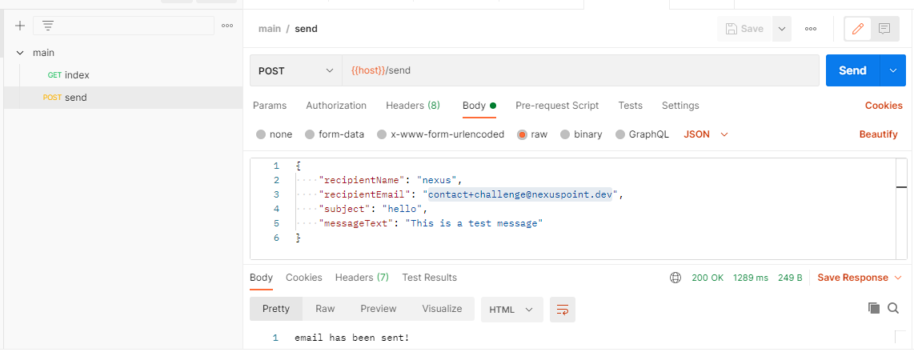

# nodejs-mailer-challenge

## Purpose

The API should provide an abstraction between two different email service providers. If one of
the services goes down, your service can quickly failover to a different provider without affecting your
customers.

## setup

1. setup IAM user and access keys on AWS and save or download.
2. open a terminal with admin permissions
3. install serverless `npm install -g serverless`
4. execute with AWS IAM user access key and secret substituted: `serverless config credentials --provider aws --key xxxxxxxxxxxxxx --secret xxxxxxxxxxxxxx`
5. setup IAM role with AWSLambda_FullAccess policy access and call the role lambda-full
6. copy the ARN for the role.
7. set in the serverless.yml file the provider role to the IAM role ARN.
8. run `serverless create -t aws-nodejs -n serverless-nodejs-mailer-challenge`
   
```
    Serverless: Generating boilerplate...
 _______                             __
|   _   .-----.----.--.--.-----.----|  .-----.-----.-----.
|   |___|  -__|   _|  |  |  -__|   _|  |  -__|__ --|__ --|
|____   |_____|__|  \___/|_____|__| |__|_____|_____|_____|
|   |   |             The Serverless Application Framework
|       |                           serverless.com, v2.23.0
 -------'

Serverless: Successfully generated boilerplate for template: "aws-nodejs"
```
9. register an account on MailGun, verify your mobile number and create an API key.
10. register an account on SendGrid, verify your mobile number and create ann API key.
11. add a verified sender or sandbox test email and name for MailGun at https://app.mailgun.com/app/dashboard
    you will also need to add an `Authorized Recipients` if you are using the sandbox feature for trial accounts which you can submit the email address under `Dashboard > Sending > Overview` form to the right.
12. add a verified sender on SendGrid at https://app.sendgrid.com/settings/sender_auth/senders
14. create a .env file on the root of the project
15. add the format and substitue configs with api keys and verified sender details in the .env file, the format of the file should be,:

```
PORT=3000
API_KEY_MAILGUN=XXXXXX
API_KEY_SENDGRID=XXXXXX
FROM_NAME_MAILGUN=XXXXXX
FROM_EMAIL_MAILGUN=XXXXXX@XXXXXX
FROM_NAME_SENDGRID=XXXXXX
FROM_EMAIL_SENDGRID=XXXXXX@XXXXXX
```

14. deploy site with running the command `serverless deploy`. this command can be used with AWS codepipline and codedeploy.
15. download and install POSTMAN at: https://www.postman.com/downloads/
16. import file `main.postman_collection.json` into POSTMAN.
17. setup enviroment variable `host` for both development and production.
* development : host = `http://localhost:3000`
* production : host = `https://XXXXXX.execute-api.ap-XXXXXXX.amazonaws.com/prod/` this would be the URL provided when the deployment command is ran.

## commands

* run dev mode `npm run start:tsdev`
* run `npm start`
* lint dry run `npm run lint`
* lint fix `npm run lint-fix`
* build from typescript before deplopyment `npm tsc`
* run test suite `npm test`
* deploying application `serverless deploy`
```
Serverless: Packaging service...
Serverless: Excluding development dependencies...
Serverless: Uploading CloudFormation file to S3...
Serverless: Uploading artifacts...
Serverless: Uploading service serverless-nodejs-mailer-challenge.zip file to S3 (892.24 KB)...
Serverless: Validating template...
Serverless: Updating Stack...
Serverless: Checking Stack update progress...
....................................
Serverless: Stack update finished...
```

## testing

manual testing with postman

- for local test, run locally `npm run start:tsdev` and choose `development` environment in postman.
- for production test, run locally `npm run ts` then `serverless deploy` and choose `production` environment in postman.



automated test suite with mocha

command: `npm test`

```
  MailGunSender
Mailgun Magnificent API
    √ sent should = true (917ms)

  SendGridSender
    √ sent should = true (1257ms)


  2 passing (2s)
```

code coverage report with instambul nyc.

command: `npm run coverage`

```
--------------------|---------|----------|---------|---------|-------------------
File                | % Stmts | % Branch | % Funcs | % Lines | Uncovered Line #s
--------------------|---------|----------|---------|---------|-------------------
All files           |   94.29 |       80 |   88.89 |   94.29 |
 model              |     100 |      100 |     100 |     100 |
  message.ts        |     100 |      100 |     100 |     100 |
 services           |   93.55 |       80 |   88.89 |   93.55 |
  MailGunSender.ts  |     100 |      100 |     100 |     100 |
  SendGridSender.ts |     100 |      100 |     100 |     100 |
  SenderAbstract.ts |   90.48 |       80 |   85.71 |   90.48 | 39,45
--------------------|---------|----------|---------|---------|-------------------
```

## ideas for improvement

1. support for many senders than the hardcoded 2
2. move code for the send route into seperate file
3. mock testing using sion
4. test fall back scenario
5. log to a dynamodb table or cloudwatch
6. more unit testing for full coverage
